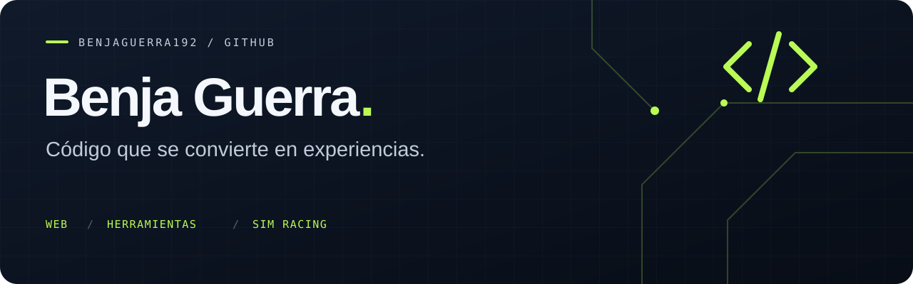

  

  <a href="https://github.com/benjaguerra192?tab=repositories"><strong>Explorar proyectos ↗</strong></a>
  &nbsp; · &nbsp;
  <a href="https://benjaguerra192.github.io/gallerynight26.github.io/">Probar Gallery Night ↗</a>

### Hola, soy Benja 👋

Creo experiencias web, herramientas de escritorio y proyectos para sim racing. Me gusta convertir una idea en algo que se pueda abrir, probar y usar: desde descubrir música con NFC hasta practicar vueltas en Assetto Corsa.

### Proyectos destacados

| Proyecto | Qué podés hacer | Explorar |
| :--- | :--- | :--- |
| **🏁 FlyingStart** | Empezar vueltas a velocidad de carrera en Assetto Corsa. App en **Lua** para Custom Shaders Patch, con velocidad y cuenta regresiva configurables. | [Código](https://github.com/benjaguerra192/FlyingStart) |
| **💿 Gallery Night · Back to the 80s** | Descubrir álbumes y desbloquear música mediante enlaces **NFC**. Experiencia web con estética ochentosa y progreso guardado en el navegador. | [Demo](https://benjaguerra192.github.io/gallerynight26.github.io/) · [Código](https://github.com/benjaguerra192/gallerynight26.github.io) |
| **📊 System Tray Usage** | Consultar el uso de CPU y RAM desde la bandeja del sistema. Monitor ligero en **Python** para Windows y Linux. | [Código](https://github.com/benjaguerra192/System-Tray-Usage) |
| **🏉 Jugadas de rugby** | Visualizar jugadas de rugby 15 desde el navegador. | [Demo](https://benjaguerra192.github.io/pagina-ed-rugby-jugadas/) · [Código](https://github.com/benjaguerra192/pagina-ed-rugby-jugadas) |

### Tecnologías en mis proyectos

  
  
  
  
  
  

### Más para explorar

[Antony & Cleopatra](https://github.com/benjaguerra192/Antony-and-Cleopatra) · [Proyecto Chernóbil](https://github.com/benjaguerra192/Proyecto-Chernobil) · [Vinyl for Spotify](https://github.com/benjaguerra192/Open-source-vinyl-for-spotify)

---

Ideas, código y proyectos que podés probar.

